# Connect 4

Connect 4 is an online remake of the classic children's game designed for two players that need to connect four of their chips in a row either vertically, horizontally or diagonally to win. I wanted to reference the theme of the original game of red vs. blue, but with a less saturated look to give it a more modern feel. The site contains two pages, the home page allows users to create their own username, the start button then redirects users to the

# Features

## Existing Features

- Player Name Form
    - Allows users to input their player name with no restriction, if no name is inputted it will throw a required message using sweet alert

    - The usernames will show in the input box as the color they will play as in the game

- Start Button
    - Start button changes color and size on hover and navigates to the game page.

    - SessionStorage logs user names and passes data to the game page

    - The Start button submits the form and navigates using window.location.assign rather than using an anchor link

- Game Page Header
    - The Header contains the game title, a back button, player turn text and the player score which changes position depending on screen size

    - The back button will go back to the first page, this resets the player names and scores
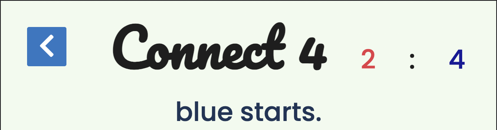

- Game Page Messages
    - The game page opens with a message informing players of who starts, after the first click the message changes to '{Player1/2}'s turn'

    - If there is an error with the sessionStorage data the player names default to Player 1 and Player 2 so there will always be information on who's turn it is

    - On a win the player message returns to '{Player1/2} Starts'

    
    

- Game Canvas
    - The player places their 'chip' by clicking on a white space. If the player clicks on a column with no free space, the turn is not taken and no chip is placed. This means the player will not waste their go if they click on a random part of the screen

    - The player's chip will always drop to the bottom space in the column, no matter where you click

    - The Player's turn changes once a chip has been placed on the canvas
    
- Win and Draw Messages
    - On a win a message fires with the player's name, the board colors stay for a few seconds before resetting so the 
    player can see the winning move

    - The alert message fires with a tick icon and the ok button appears in the color of the winning player

    - Pop up messages use sweet alert as it is both clearer and nicer to view than a native is alert message
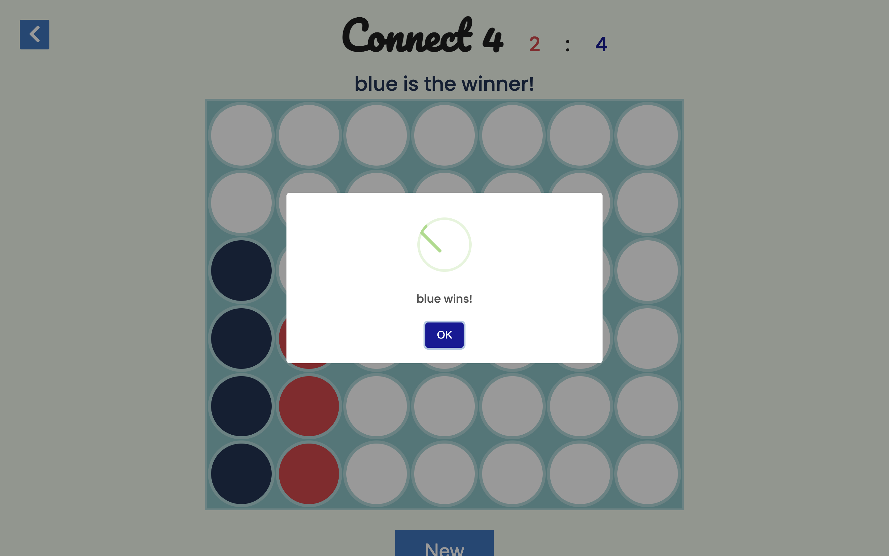
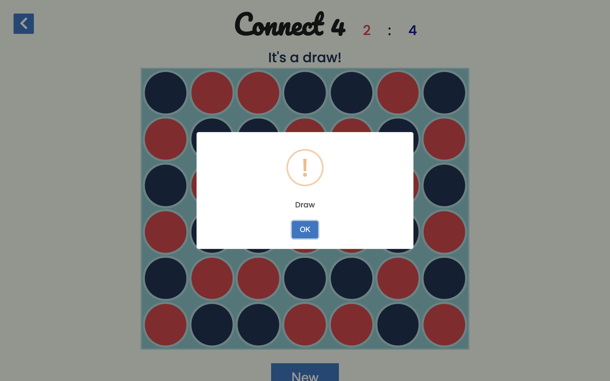

# Design Stage: 

This version of connect four gave me inspiration for creating my version of the game, although with parts that are certainly too complex for me at this stage. The inclusion of a color indicator for the player turn prompted me to include this in various areas of my site, such as when the player enters their name, the player turn text and the color of the ok button on a winning result.

https://codethislab.com/html5-game-connect-4/

- What MUST be include:
    - Changes between player one and player two after each go
    
    - Cannot place chips anywhere on the board, they must stack ontop of each other
    
    - Placing 4 of the same colour chips in a row, colum or diagnally gives a win
    
    - detect which player won and display message

- What should be included
    - Player turn indicator
    
    - Reset button
    
    - back button

- Non-essential elements that could be added
    - start menu
    
    - AI player option
    
    - timer

The classic game of connect 4 is 7 counters wide and 6 counters high so I followed this design.

I looked at several tutorials to build the basis for the app, some had an array of all the winning moves which didn't require much logic, however, it would mean that if I wanted to change the amount of spaces on the canvas in the future (for example, having a larger 3 v 3 mode) then it would be very time consuming and tedious rather than just changing a few numbers in the winning move functions.

I chose to follow this tutorial below as it was seemed easier to comprehend in comparison to other examples, there was also plenty of room for improvement as this is quite a basic game compared to the earlier example.

- This is the link to the tutorial I followed
https://www.youtube.com/watch?v=Z_IaJQojun8&t=1s&ab_channel=ConorBailey

## Wire Frames

- Desktop layout plan

- mobile layout plan

## Colour Palette

Selected colors based on combinations suggested by this site, colors were based on the traditional connect 4 scheme of blue and red but with less saturation. The is a slightly lighter border to allow the canvas stand out from the background and the chip colors, this also gives the site come variation. The blue player color is quite dark, using the same color for the text looked almost black, a more saturated blue is used instead to give a clearer indication for who's turn it is. As the red stands out enough I kept that the same color value throughout.
https://coolors.co/palettes/trending

- Red player #E63946
- Canvas blue #A8DADC
- Blue player #1D3557
- Blue text #181A99
- background #F1FAEE
- Button color #2778C4

## Reset Button

The reset button allows players to restart a round, this does not affect the players score. This function is also called when a player wins. Initially when called the canvas would reset immediately, I decided instead to delay this so players could see the winning move. Initially I tried to call the reset function using an event listener on the sweet alert button, however I could not get this to work so instead opted for a setTimeout. The setTimeout only affects the reset on a win, when pressing the button the game resets immediately.

# Testing

## Validator Testing

All validation has passed for CSS and HTML, the JSHint threw many errors that cannot be changed.

- CSS Validation
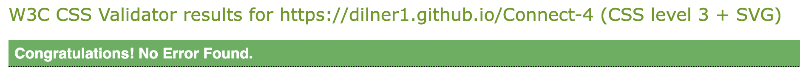 
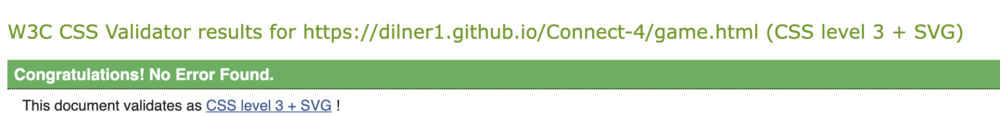

- HTML Validation
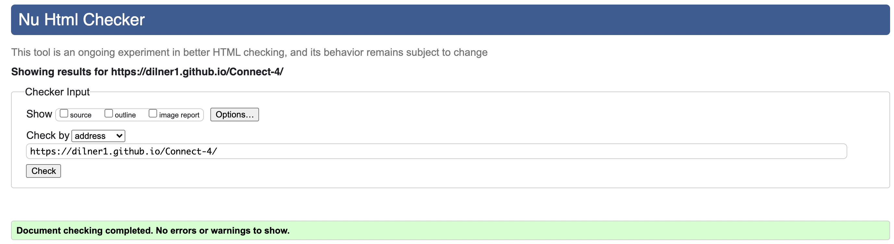 
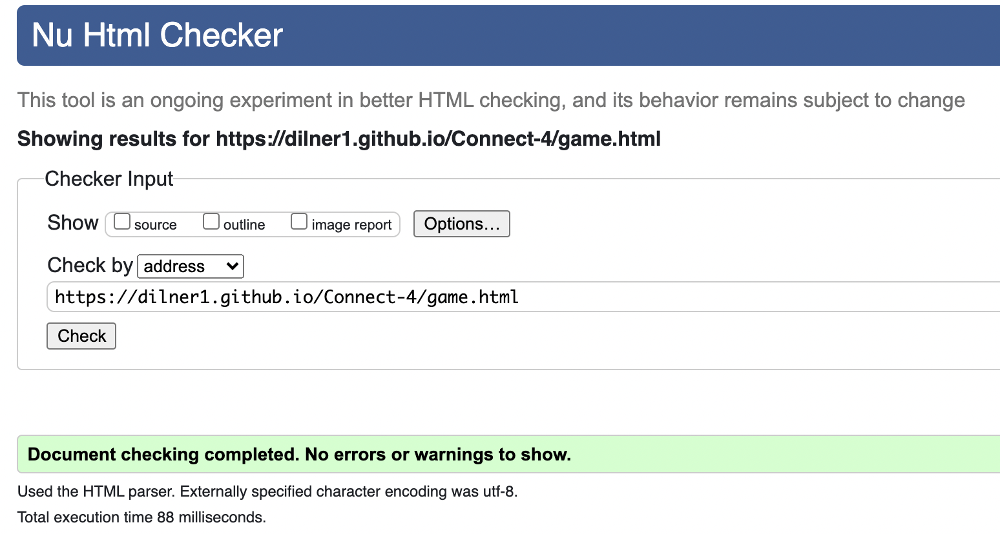

- JSHint Validation

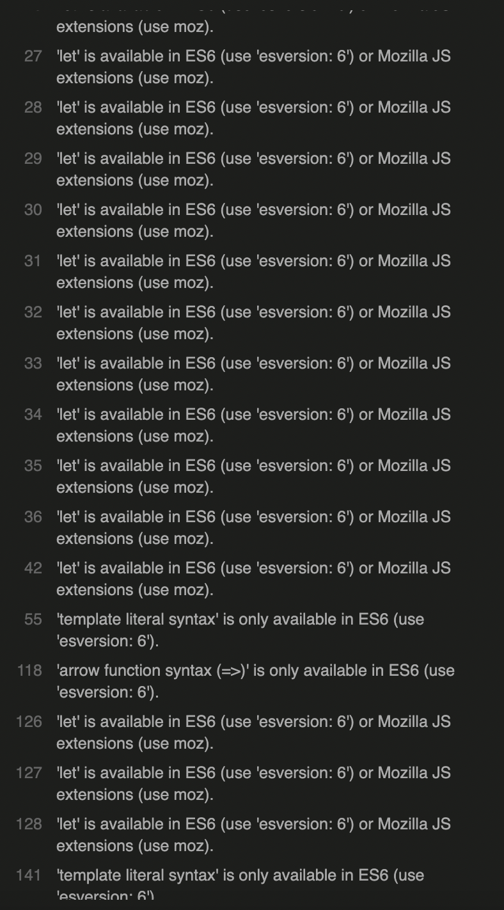

There is an issue with the template literal syntax, however this is vital for how the code functions, as they are used to pull the player names from storage. Without these the player is unable to set their own username. Errors advised changing arrow functions, this was not as much of an issue as there were only two instances where they were used and can be changed easily.

A common error was 'let' is available in ES6 (use 'esversion: 6') or Mozilla JS extensions (use moz). The same eorror also appears for const variables. These are unavoidable as the variables should not be changed to var.

## Lighthouse Scores
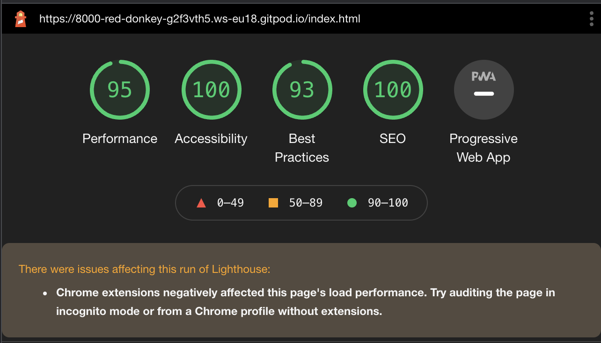

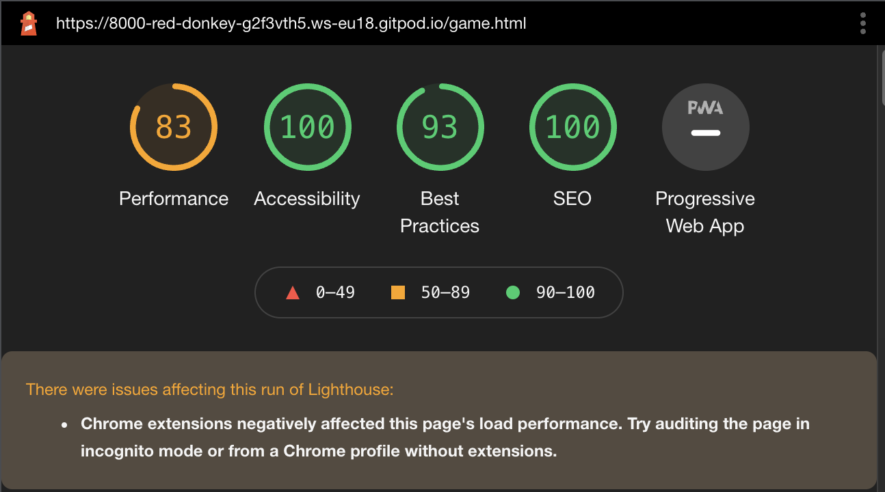

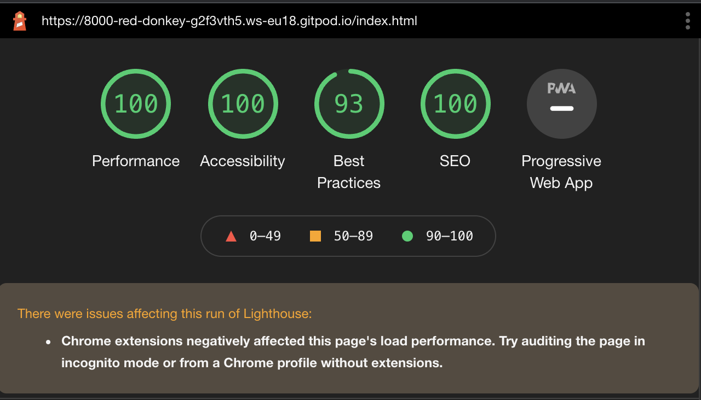

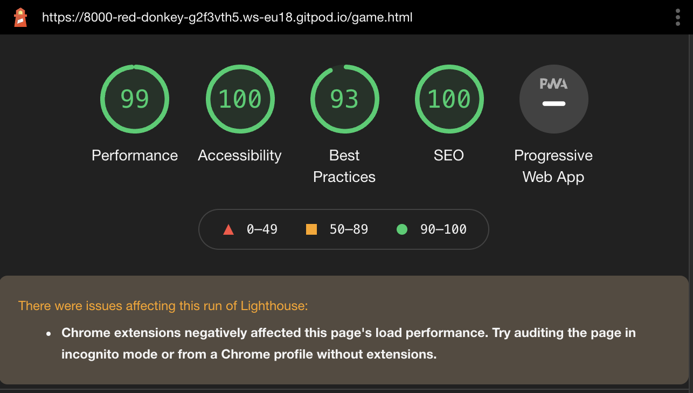

## Automatic Naming in Case of Error
 
To proof the site from breaking if there is an issue with the session storage there is a function called checkUserhasName that determines if there are still values. This If there are no values for  the names are set to 'Player 1' or 'Player 2', this is just to prevent the names from showing as null.

## Submit Button

I wanted to have the submit button also navigate to the game page as this would keep the layout uncluttered, this worked prior to implimenting working stored usernames by using an anchor tag. The inputs had 'required' tags however these only prevented the form from submitting once, after more than one click the the game generated name variables and sent the user to the game page. The values would be null for the first two clicks and then continue as 'Player 1' and 'Player 2' (the automatic naming causes this and I believe to be the reason this is an issue in the first place). I wrote a function that validates both inputs for null or '' values, a sweet alert is fired if so. Removing the anchor tag and using window.location.assign instead allowed me to have more control over when the user is directed to the game page. This was chosen over .replace as I still wanted users to go back to the home screen if they needed.

## Unfixed Bugs

## Responsive Design

When looking at the grid on the inspect screen, the site scales well in different sizes.

When looking at the github link on mobile the chips do not space out correctly however, have adjust the width and height from 14% to use transform:scale() however this doesn't fix the issue. This is very confising as it works perfectly fine as shown on when looking at responsive design on the laptop. On top of this the site was tested on an alternative phone which worked. 

- 

- Alternative phone 
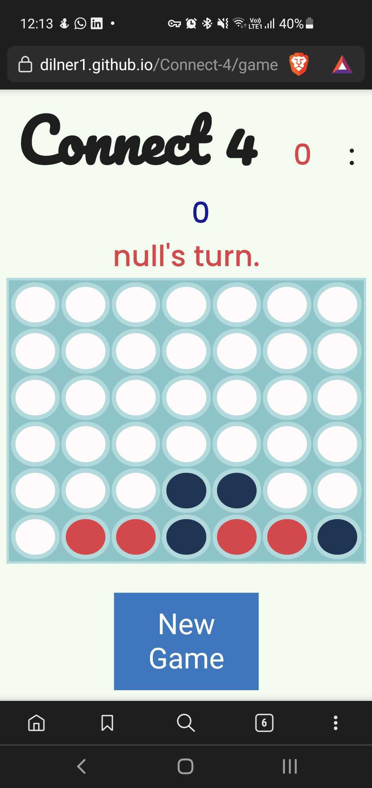

## Color Values

Whilst not a bug as such, the constant EMPTY_SPACE_COLOR is set to white, this is not best practice and should be an rbg value. When the value is changed to rgb the code breaks however but I am unsure as to why.

# Deployment

The site was deployed to GitHub pages. The steps to deploy are as follows:

In the GitHub repository, navigate to the Settings tab In the pages section, go to select branch drop-down menu, select Main Once the Main branch has been selected, a link to the site is provided

The live link can be found here - https://dilner1.github.io/Connect-4/

# Credits

## Content

Font was sourced from Google Fonts https://fonts.google.com/
Pop up alerts are implimented from sweetalert2 https://sweetalert2.github.io/#examples

## Media

No images or videos were sourced for this project
