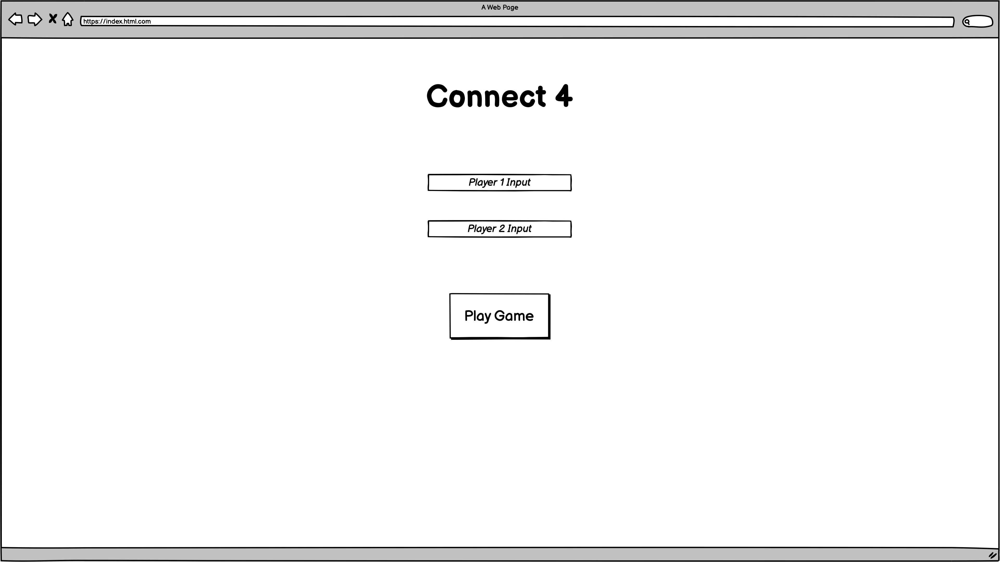
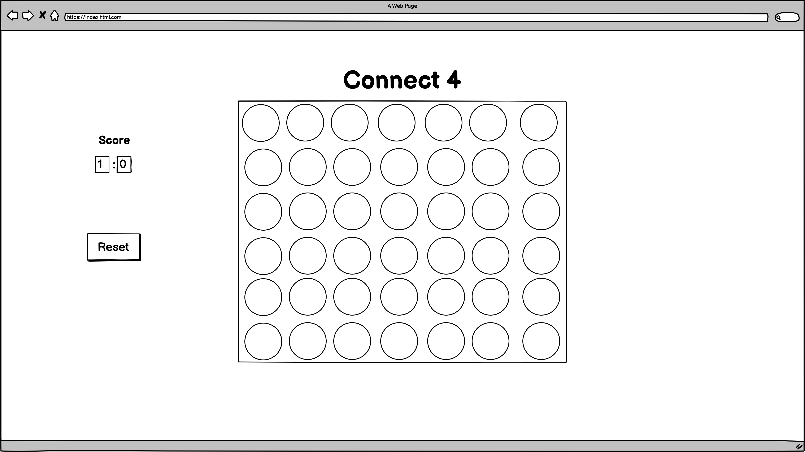
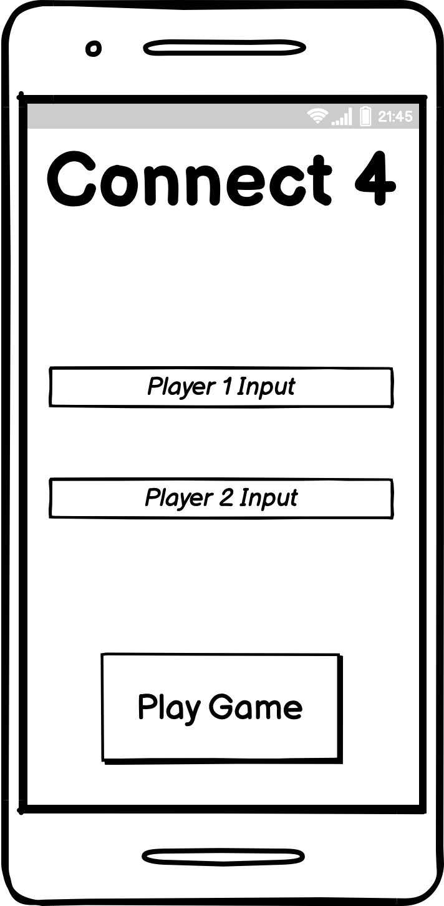
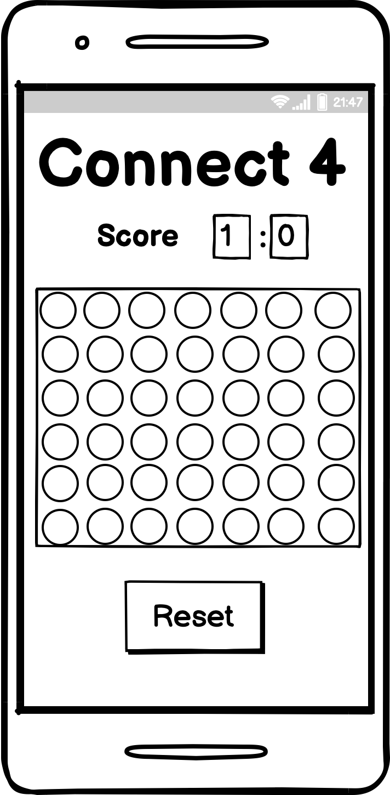

# Features

## Existing Features

- Player name form
    - Allows users to input their player name, if no name is inputted it will throw a required message
    - Inputted usernames show in the color they will play in on screen
- Start Button
    - Start game button changes color and size on hover and navigates to game page.
    - SessionStorage logs user names and pass data to game page
    - Navigates using window.location.assign rather than anchor link

- Player turn messages
    - Opens with message informing players of who starts, after the first click the message changes to '{Player1/2}'s turn'
    - If there is an error with the sessionStorage the player names default to Player 1 and Player 2
    - On a win the player message resetes to '{Player1/2} Starts'

    
    

- Canvas
    - Player places 'chip' on click but only when on a column with free space. The player must click on the actual space, the  player doesn't waste their turn if they click on any ramdom part of the screen
    - The player chip will always go to the bottom space in the colum, no matter where you click
    - Player go changes when clicking the table data 'chip'
    
- Win and draw messages
    - On a win a message fires with the players name, the board colors stay for a few seconds before resetting so player can see the winning move
    - Messages use sweet alert as it is much nicer than a js alert message

 
    
## Design Stage: 

This version of connect four gave me inspiration on creaitng my game, although with parts that are certainly too complex for me at this stage.

https://codethislab.com/html5-game-connect-4/

- What MUST be include:
    - Changes between player one and player two after each go
    - Cannot place chips anywhere on the board, they must stack ontop of each other
    - Placing 4 of the same colour chips in a row, colum or diagnally gives a win
    - detect which player won and display message

What should be included
    - Player turn indicator
    - Reset button

Non-essential elements that could be added
    - start menu
    - AI player option
    - timer

The classic game of connect 4 is 7 counters wide and 6 counters high so I followed this design.

I looked at several tutorials to build the basis for the app, some has an array of all the winning moves however this didn;t require much logic and was time consuming so I didn't want to go down this Route. I chose the following as it was slightly easier to read in comparison on other examples and because it ustalised for loops and functions for each winning move this would be not only easier to maintain but also more of a challenge to learn.

- This is the link to the tutorial I follows
https://www.youtube.com/watch?v=Z_IaJQojun8&t=1s&ab_channel=ConorBailey

## Wire Frames

- Desktop layout plan

- mobile layout plan

## Colour Palette

Selected colors based off of combinations suggestrd by this site, colors were based on the traditional connect 4 color scheme of blue and red but with less saturation.
https://coolors.co/palettes/trending

- Player red E63946
- Canvas blue A8DADC
- Player blue 1D3557
- background F1FAEE
- Alternative B1E1A3

## Reset Button

Implemented a reset button for players to restart a round, this does not effect the players score. This function is also called when a player wins. Initially when called the canvas would reset immediately, decided instead to delay the rest so players could see the move that won the game. Initially tried to call the reset using an event listener to the sweet alert however I could not get this to work so instead opent for a setTimeout.

# Testing

## Validator Testing

## Changes to base code

Following the tutorial the following code was added to log mouse clicks to the console. After realising it doesn't actually benefit the game in any way I removed it completely without consequence.

## Automatic Nameing

To proof the site from breaking if there is an issue with the session storage there is a function that checks on each click if there are still values. if not the names are set to 'Player 1' or 'Player 2', this is just to prevent the names from showing as null.

## Submit Button

I wanted to have the submit button also navigate to the game page as this would keep the layout uncluttered, this worked prior to implimenting working stored usernames by using an anchor tag. The inputs had 'required' tags however these only prevented the form from submitting once, after more than one click the the game generated name variables and sent the user to the game page. The values would be null for the first two clicks and then continue as 'Player 1' and 'Player 2' (the automatic naming causes this and I believe to be the reason this is an issue in the first place). I wrote a function that validates both inputs for null or '' values, a sweet alert is fired if so. Removing the anchor tag and using window.location.assign instead allowed me to have more control over when the user is directed to the game page. This was chosen over .replace as I still wanted users to go back to the home screen if they needed.

## Unfixed Bugs

## Responsive Design

When looking at the grid on the inspect screen, the site scales well in different sizes.

When looking at the github link on mobile the chips do not space out correctly however, have adjust the width and height from 14% to use transform:scale() however this doesn't fix the issue. This is very confising as it works perfectly fine as shown on when looking at responsive design on the laptop

## Color Values

Whilst not a bug as such, the constant EMPTY_SPACE_COLOR is set to white, this is not best practice and should be the rbg value. When the value is changed to rgb the code breaks however but I am not sure why.

# Deployment

The site was deployed to GitHub pages. The steps to deploy are as follows:

In the GitHub repository, navigate to the Settings tab In the pages section, go to select branch drop-down menu, select Main Once the Main branch has been selected, a link to the site is provided

The live link can be found here - https://dilner1.github.io/Connect-4/

# Credits

## Content

Font was sourced from Google Fonts https://fonts.google.com/
Pop up alerts are implimented from sweetalert2 https://sweetalert2.github.io/#examples

## Media

No images or videos were sourced for this project
