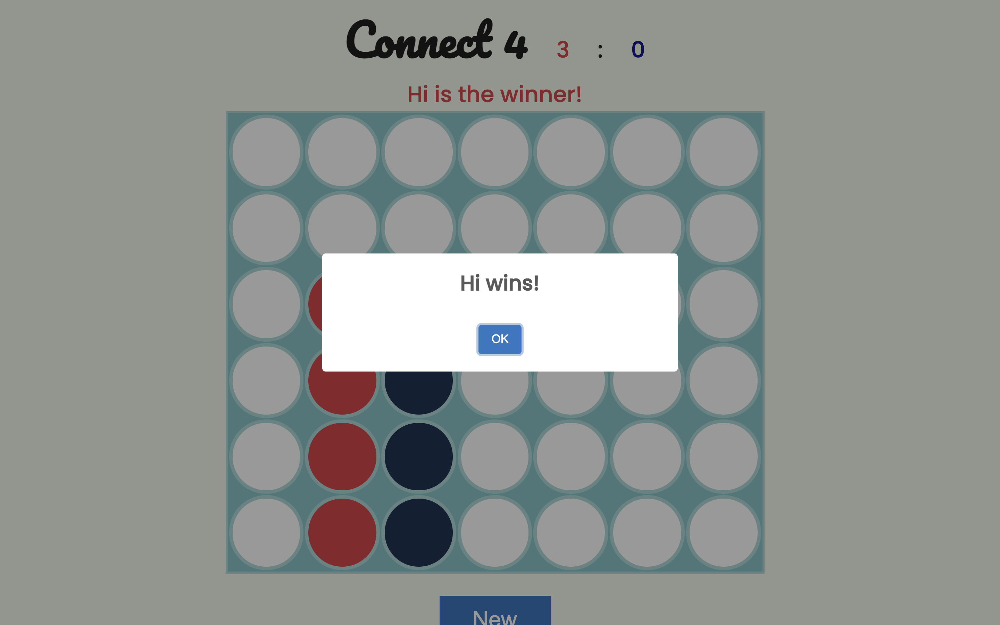
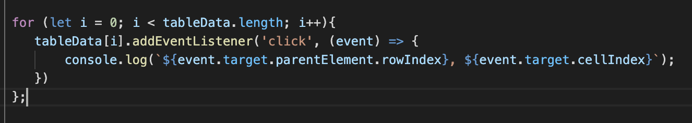
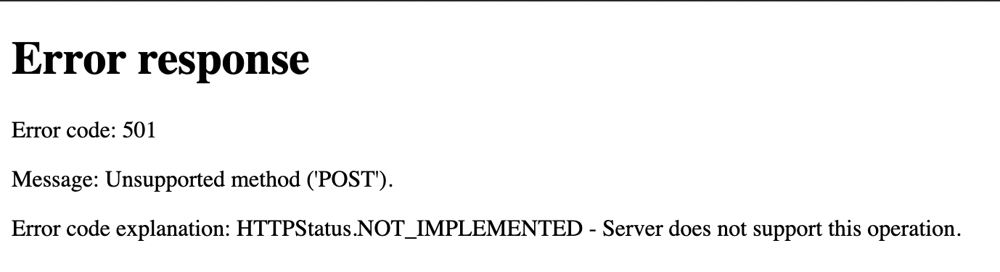
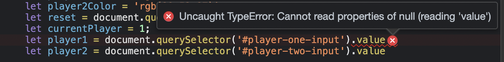
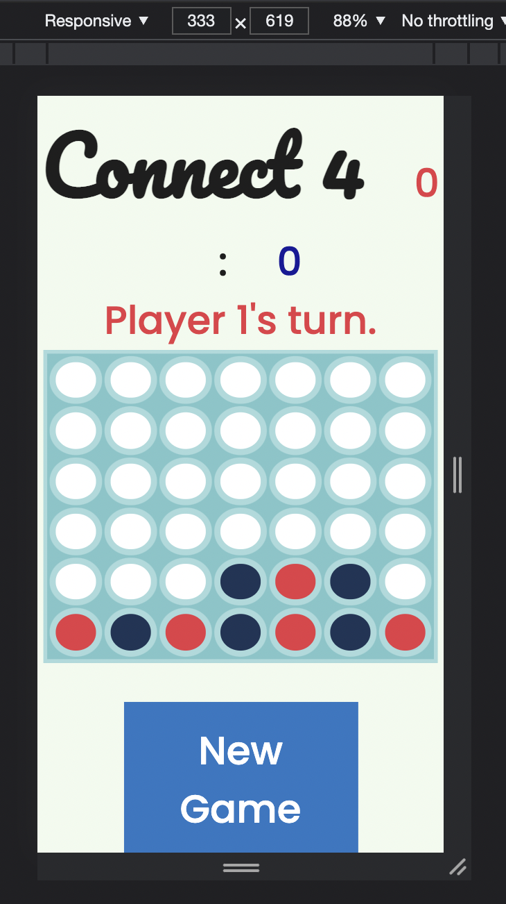
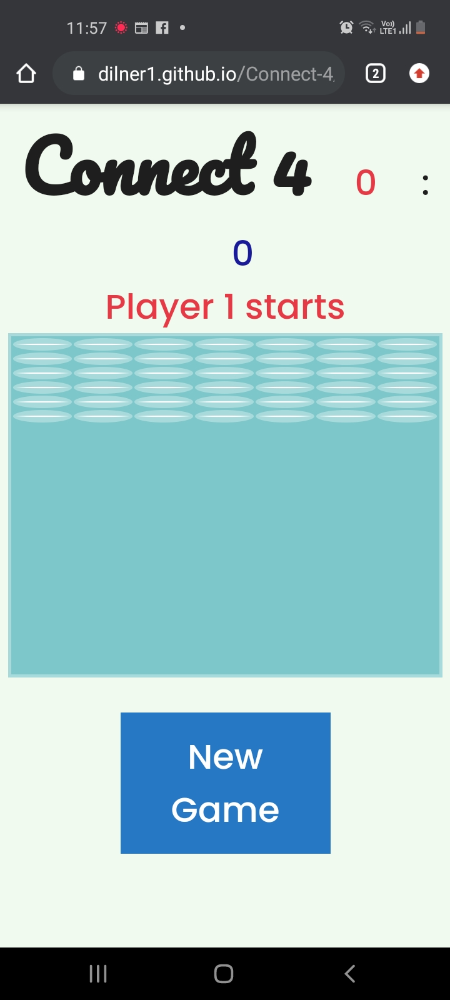

# Features

## Existing Features

- Player name form
    - Allows users to input their player name, if no name is inputted it will throw a required message
    - Inputted usernames show in the color they will play in on screen
- Start Button
    - Start game button changes color and size on hover and navigates to game page.
    - Uses sessionStorage to log user names and pass data to game page

- Player turn messages
    - Opens with message informing players of who starts, after the first click the message changes to '{Player1/2}'s turn'
    - If there is an error with the sessionStorage the player names default to Player 1 and Player 2
    - On a win the player message resetes to '{Player1/2} Starts'

    
    

- Canvas
    - Player places 'chip' on click but only when on a column with free space. The player must click on the actual space, the  player doesn't waste their turn if they click on any ramdom part of the screen
    - The player chip will always go to the bottom space in the colum, no matter where you click
    - Player go changes when clicking the table data 'chip'
    
- Win and draw messages
    - On a win a message fires with the players name, the board colors stay for a few seconds before resetting so player can see the winning move
    - Messages use sweet alert as it is much nicer than a js alert message

- 
    

## Design Stage: 

This version of connect four gave me inspiration on creaitng my game, although with parts that are certainly too complex for me at this stage.

https://codethislab.com/html5-game-connect-4/

- What MUST be include:
    - Changes between player one and player two after each go
    - Cannot place chips anywhere on the board, they must stack ontop of each other
    - Placing 4 of the same colour chips in a row, colum or diagnally gives a win
    - detect which player won and display message

What should be included
    - Player turn indicator
    - Reset button

Non-essential elements that could be added
    - start menu
    - AI player option
    - timer

The classic game of connect 4 is 7 counters wide and 6 counters high so i will follow this design.

## Colour Palette

Selected colors based off of combinations suggestrd by this site, colors were based on the traditional connect 4 color scheme of blue and red but with less saturation.
https://coolors.co/palettes/trending

- Player red E63946
- Canvas blue A8DADC
- Player blue 1D3557
- background F1FAEE
- Alternative B1E1A3

## Reset Button

Implemented a reset button for players to restart a round, this does not effect the players score. This function is also called when a player wins. Initially when called the canvas would reset immediately, decided instead to delay the rest so players could see the move that won the game. Initially tried to call the reset using an event listener to the sweet alert however I could not get this to work so instead opent for a setTimeout.

# Testing

## Validator Testing

## Changes to base code

Following the tutorial the following code was added to log mouse clicks to the console. After realising it doesn't actually benefit the game in any way I removed it completely without consequence.

When coding the reset button I used a querySelector however forgot to put the '.' before class name so I kept returning the error app.js:153 Uncaught TypeError: Cannot read property 'addEventListener' of null
    at HTMLDocument.<anonymous>

## Submit Button

Created a function that allowed submit button to also redirect to the game however POST method was causing an issue - for now am using GET.

This still didn't redirect to the correct page, this was because I set the action as app.js rather than game.html.

The second part of the form issue was this error message

There is an issue with collecting data from the form itself

## Unfixed Bugs

## Responsive Design

When looking at the grid on the inspect screen, the site scales well in different sizes.

When looking at the github link on mobile the chips do not space out correctly however, have adjust the width and height from 14% to use transform:scale() however this doesn't fix the issue. This is very confising as it works perfectly fine as shown on when looking at responsive design on the laptop

# Deployment

# Credits

## Content

## Media